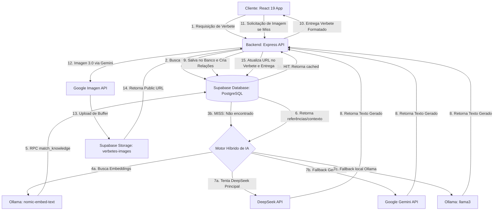

# Wikipreta.org - Framework de Arquitetura e Desenvolvimento Futuro 🏿✨

Este documento define e descreve a arquitetura de engenharia, o fluxo de dados e as diretrizes de desenvolvimento do **Wikipreta.org**. Ele serve como um manual completo para apoiar a manutenção e o desenvolvimento contínuo da plataforma por equipes futuras.

---

## 1. Visão Geral do Sistema

O Wikipreta.org é uma enciclopédia interativa e colaborativa sobre a história e cultura negra. O sistema combina renderização dinâmica de conteúdo, persistência inteligente em banco de dados na nuvem (Supabase) e um motor híbrido de inteligência artificial (DeepSeek, Gemini e Ollama local) para geração e curadoria assistida de verbetes.

### Diagrama de Fluxo Arquitetural



---

## 2. Stack Tecnológica Detalhada

O projeto é construído sobre três pilares de tecnologia:

| Camada | Tecnologia | Função Principal | Arquivo de Entrada / Configuração |
| :--- | :--- | :--- | :--- |
| **Frontend** | React 19 + Vite | Interface SPA responsiva, com temas dinâmicos e navegação fluida | [index.html](file:///d:/projects/react_projects/wikipreta.org/index.html) / [vite.config.ts](file:///d:/projects/react_projects/wikipreta.org/vite.config.ts) |
| **Backend** | Express.js | API Gateway intermediário que isola credenciais de IA e lida com RAG local | [api/index.js](file:///d:/projects/react_projects/wikipreta.org/api/index.js) |
| **Persistência** | Supabase | PostgreSQL para dados estruturados, bucket público para imagens e RLS | [api/supabase.js](file:///d:/projects/react_projects/wikipreta.org/api/supabase.js) / [services/supabase.ts](file:///d:/projects/react_projects/wikipreta.org/services/supabase.ts) |
| **IA Textual** | DeepSeek / Gemini | Geração contextualizada de artigos com destaque automático de links | [api/index.js](file:///d:/projects/react_projects/wikipreta.org/api/index.js) (Linha 239) |
| **IA Visual** | Imagen 3.0 | Criação de artes conceituais quentes/terrosas sobre temas de verbetes | [api/index.js](file:///d:/projects/react_projects/wikipreta.org/api/index.js) (Linha 342) |
| **RAG Local** | Ollama | Geração de embeddings com `nomic-embed-text` e fallback com `llama3` | [api/index.js](file:///d:/projects/react_projects/wikipreta.org/api/index.js) (Linha 185) |

---

## 3. Fluxo de Ciclo de Vida do Conteúdo (Cache Híbrido)

### Resolução de Termos (Slugification)
A busca por verbetes na Wikipreta é insensível a acentos e ignora artigos e preposições conectivas comuns (`a, o, da, do, na, no, de, e`). Isso unifica buscas semelhantes sob um mesmo registro uniforme (Slug).
* Lógica implementada em: [api/utils.js](file:///d:/projects/react_projects/wikipreta.org/api/utils.js).
* Exemplo: `"O Quilombo dos Palmares"` e `"Quilombo de Palmares"` convertem-se no slug `quilombo-palmares`.

### Estratégia de Hit/Miss
Ao solicitar um termo pelo frontend ([services/databaseService.ts](file:///d:/projects/react_projects/wikipreta.org/services/databaseService.ts)):
1. **Verificação em Banco (Hit)**:
   - A API Express executa a busca do slug correspondente na tabela `topics` do Supabase.
   - Se o registro existir e a fonte for confiável (`gemini` ou `user`), os dados estruturados são retornados imediatamente, reduzindo o custo e a latência de geração por IA.
2. **Fallback / Geração Contextual (Miss)**:
   - Se o verbete não for encontrado na tabela de cache, o motor de geração de conteúdo híbrido entra em ação para construí-lo em tempo real, realizando a busca semântica em fontes próprias e consultando as IAs de acordo com a ordem de preferência configurada.

---

## 4. Sistema RAG (Retrieval-Augmented Generation)

Para evitar alucinações das IAs generativas e assegurar que as definições usem termos referenciados e livros históricos oficiais, a Wikipreta implementa uma estrutura de RAG híbrido:

1. **Geração de Embeddings**:
   - Para o termo buscado (ex: "Milton Santos"), a API Express gera um vetor de 768 dimensões fazendo uma chamada local ao modelo `nomic-embed-text` rodando no Ollama (porta `11434`).
2. **Busca Vetorial**:
   - O vetor de busca é submetido à função remota RPC `match_knowledge` no Supabase PostgreSQL.
   - Essa função busca na tabela `knowledge_base` (habilitada com a extensão `pgvector`) trechos com similaridade de cosseno acima de `0.35`.
3. **Injeção de Contexto**:
   - Os fragmentos de texto retornados (de livros oficiais e fontes cadastradas) são anexados diretamente ao prompt enviado à IA, servindo como a fonte primária de verdade histórica para redigir o parágrafo enciclopédico.

Para mais detalhes sobre a modelagem e ingestão vetorial, veja [docs/MANUAL_RAG.md](file:///d:/projects/react_projects/wikipreta.org/docs/MANUAL_RAG.md) e [docs/IA_CONHECIMENTO_PROPRIO.md](file:///d:/projects/react_projects/wikipreta.org/docs/IA_CONHECIMENTO_PROPRIO.md).

---

## 5. Pipeline de Imagens

As imagens exibidas nos verbetes seguem um ciclo dinâmico de três camadas:

1. **Galeria Local Randômica**:
   - Usada por padrão quando o sistema está em modo *mock* ou o usuário acessa no frontend sem autenticação administrativa. As imagens residem no diretório [public/assets/images/random](file:///d:/projects/react_projects/wikipreta.org/public/assets/images/random).
2. **Geração via Imagen 3.0**:
   - Quando um editor autorizado solicita a criação de imagem para um verbete sem foto, a API Express chama o modelo `imagen-3.0-generate-001` da Gemini API.
   - A imagem gerada (em formato `base64`) é convertida em um buffer binário e enviada ao bucket público `verbetes-images` no Supabase Storage.
3. **URL Persistida Customizada**:
   - A URL pública resultante do Supabase Storage é salva no campo `image_url` na tabela `topics` do banco. Edições subsequentes do verbete também permitem que administradores informem URLs de imagens históricas personalizadas.

---

## 6. Segurança e Políticas RLS (Row Level Security)

A Wikipreta utiliza o Supabase para assegurar que dados sensíveis não sejam expostos e que apenas usuários devidamente autenticados possam realizar mutações.

### Políticas Ativas no PostgreSQL

As tabelas de produção possuem Row Level Security (RLS) habilitadas, definidas no manual [docs/SUPABASE_SETUP.md](file:///d:/projects/react_projects/wikipreta.org/docs/SUPABASE_SETUP.md):

* **Tabela `public.topics`**:
  ```sql
  CREATE POLICY "Verbetes são públicos" ON public.topics FOR SELECT USING (true);
  CREATE POLICY "Apenas editores criam verbetes" ON public.topics FOR INSERT WITH CHECK (auth.role() = 'authenticated');
  CREATE POLICY "Apenas editores atualizam verbetes" ON public.topics FOR UPDATE USING (auth.role() = 'authenticated');
  ```
* **Tabela `public.revisions`**:
  ```sql
  CREATE POLICY "Histórico é público" ON public.revisions FOR SELECT USING (true);
  CREATE POLICY "Apenas editores criam revisões" ON public.revisions FOR INSERT WITH CHECK (auth.role() = 'authenticated');
  ```

### Proteção no Backend e Sessões
- O frontend gerencia os tokens JWT utilizando o [context/AuthContext.tsx](file:///d:/projects/react_projects/wikipreta.org/context/AuthContext.tsx), comunicando-se de forma assíncrona com o Supabase Auth.
- Rotas críticas que geram custos adicionais de IA (como a criação de imagens novas `/api/gemini/image`) exigem validação de cabeçalho `Authorization` no backend Express ([api/index.js](file:///d:/projects/react_projects/wikipreta.org/api/index.js#L377)).
- Toda modificação de texto dispara um gatilho de auditoria, criando um registro histórico imutável associado ao e-mail do autor da edição na tabela `revisions`.

---

## 7. Guia Prático para o Desenvolvedor

### Configuração de Ambiente (`.env.local`)
Você precisará configurar as chaves de integração. Utilize o arquivo `.env.example` como referência:

```env
# AI Providers
DEEPSEEK_API_KEY=sua_chave_deepseek_aqui
GEMINI_API_KEY=sua_chave_gemini_aqui

# Supabase Local/Nuvem
VITE_SUPABASE_URL=https://seu-projeto.supabase.co
VITE_SUPABASE_ANON_KEY=eyJhbGciOiJIUzI1NiIsInR5cCI6IkpXVCJ9...
SUPABASE_SERVICE_ROLE_KEY=sua_chave_role_privada_para_backend

# Local RAG
PREFER_OLLAMA=false
OLLAMA_BASE_URL=http://localhost:11434
OLLAMA_MODEL=llama3
```

### Scripts de Execução (via `pnpm` ou `npm`)
- `pnpm dev`: Inicia o frontend em ambiente local (Vite).
- `pnpm dev:server`: Inicia o backend local (Express escutando na porta `4000`).
- `pnpm dev:all`: Executa concorrentemente o frontend e o servidor do backend.

### Validação TypeScript
Sempre que fizer alterações no código React, valide a compilação localmente para evitar quebras em produção antes de submeter commits:
```bash
npx tsc --noEmit
```

### Padrão de Commits
O projeto adota a convenção de **Conventional Commits** para as mensagens de commit de código:
- `feat:` Novas telas, endpoints ou integrações.
- `fix:` Resolução de falhas ou correções lógicas.
- `security:` Modificação de regras de segurança RLS ou validações de token.
- `refactor:` Melhorias arquiteturais sem alteração de comportamento externo.
- `docs:` Criação ou manutenção de arquivos markdown e manuais técnicos.

---

## 8. Roteiro de Evolução (Próximos Passos)

Para o futuro desenvolvimento do Wikipreta.org, as seguintes tarefas estruturais são recomendadas:

1. **Ingestão Automatizada de Fontes (RAG)**:
   - Criar um script CLI em `api/scripts/ingest.js` para parsear arquivos PDF/DOCX de livros históricos cadastrados e enviar os embeddings diretamente para a tabela `knowledge_base` do Supabase em lotes.
2. **Interface Visual de Citação**:
   - Ajustar o componente de renderização no frontend para destacar de qual parágrafo/página de livro uma dada informação foi consultada pelo RAG, tornando o verbete academicamente auditável.
3. **Workflow de Rascunho vs. Publicação (Aprovação)**:
   - Expandir a tabela `topics` com a coluna `published BOOLEAN DEFAULT false`. Modificações feitas por editores salvam como rascunhos, e um painel de administração permite que revisores seniores publiquem a versão revisada.
4. **Armazenamento de Embeddings Nativo na Nuvem**:
   - Transicionar a geração de embeddings do Ollama local para modelos em nuvem (`text-embedding-004` da Google Gemini) para tornar o backend 100% serverless, eliminando a dependência de um servidor local Ollama.
